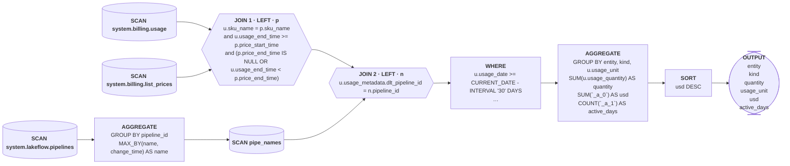

# Worked example — `job_spend_plan`

A committed `mode=plan` diagram of the per-job spend query from `scripts/project_costs.py`. All of
`reports/` is gitignored generated output, so the three artifacts live here in `examples/` instead —
a committed path — and that is where any future example belongs too:

- `examples/job_spend_plan.sql` — the query as analysed, f-string placeholders already resolved
- `examples/job_spend_plan.mmd` — the graph
- `examples/job_spend_plan.svg` — the same graph, for prose that can't render Mermaid

Regenerate it with:

```bash
make sql-diagram sql=.claude/skills/sql-diagram/examples/job_spend_plan.sql \
  name=job_spend_plan comments=1
# then copy reports/sql-diagram/job_spend_plan.* back over examples/ to refresh this example
```

Because the committed `.sql` is the post-substitution query, that command reproduces the diagram
exactly — which is the whole reason the `.sql` is committed alongside the picture.

## The graph



## How to read it

**Shape first.** Three source tables, two joins, one CTE, grouped to one row per entity × kind ×
unit and sorted by dollars. `system.billing.usage` is the fact; the other two are lookups.

**The CTE is its own sub-pipeline.** `n0 → n1` is `pipe_names` being built (dedupe
`system.lakeflow.pipelines` to one current name per `pipeline_id` via `MAX_BY`), and `n2` is the
`SCAN` that reads the finished CTE back. That two-node shape is what a CTE always looks like here —
it isn't a duplicate scan of the same table.

**Both joins are `LEFT`, and that is load-bearing.** Usage rows survive even when no price row
matches or the pipeline has no name. An `INNER JOIN` here would silently drop unpriced SKUs and
under-report spend — exactly the kind of thing to say out loud, because it changes what a missing
row in the output means.

**JOIN 1 carries three predicates, not one.** The equality on `sku_name` plus two range predicates
on `price_start_time` / `price_end_time`. `list_prices` is a slowly-changing dimension with one row
per price period, so those ranges are what pick a single price rather than fanning every usage row
out across every historical price. This is the under-constrained-join failure mode the skill warns
about — here it is correctly constrained, and worth naming as such.

**`usage_metadata` is the hub.** Three separate expressions read it (`job_name`, `dlt_pipeline_id`,
`job_id`), so it is where a schema change would hurt most. Note that lineage mode would collapse all
three to `usage_metadata`, the struct root — this is the case the skill's "struct columns collapse"
limit describes, and the reason `plan` is the better mode for this query.

**`_a_0` and `_a_1` are synthetic.** `sqlglot` lifted the `usage_quantity * pricing…` product and
the `DISTINCT usage_date` out of their aggregates. Read the intent from the `.sql` — `usd` is a
priced sum, `active_days` a distinct-day count — rather than repeating the placeholder names at the
user.

**The grey comment lines** under the two `system.billing` scans came from `comments=1` reading Unity
Catalog. They are fetched, never authored. `pipe_names` has none because a CTE isn't a catalog
object.
