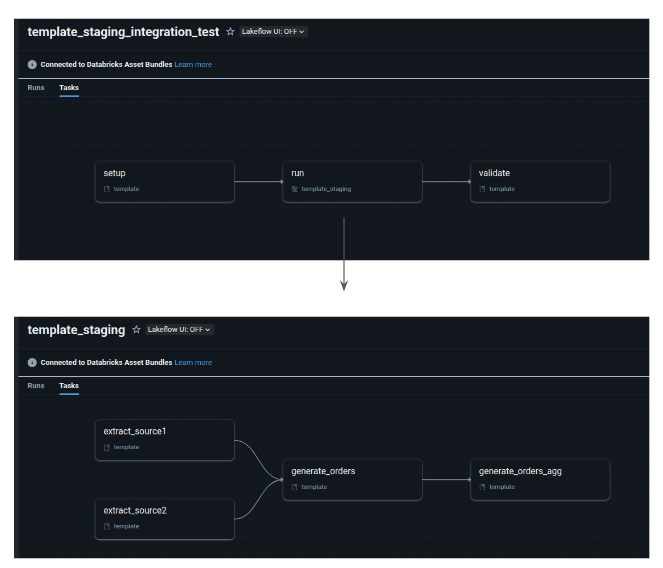
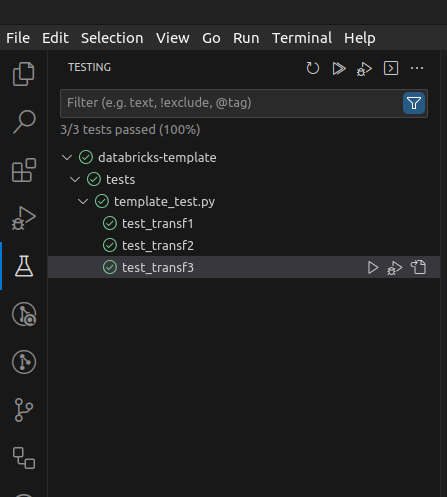
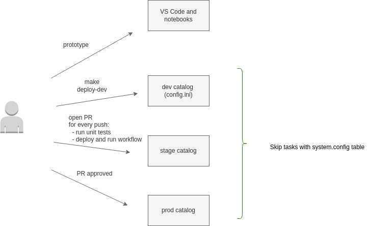

## Project Template for a PySpark/Databricks project (with automation for CI/CD)

This project template provides a structured approach to enhance your productivity when delivering data pipelines on Databricks. Feel free to further customize it based on your project's specific nuances and the audience you are targeting.

This project template demonstrates how to:

- structure your PySpark code inside classes/packages.
- configure your pipeline to run in dev and prod environments.
- set up VS Code to execute local unit tests for your transformations.
- utilize [pytest package](https://pypi.org/project/pytest/) to run unit tests on transformations.
- utilize [funcy package](https://pypi.org/project/funcy/) to log the execution time of each transformation.
- utilize [chispa package](https://pypi.org/project/chispa/) to validate the outputted dataframes from your transformations.
- utilize [Databricks Workflows](https://docs.databricks.com/en/workflows/index.html) to execute a DAG (refer to the diagram below) and [task values](https://docs.databricks.com/en/workflows/jobs/share-task-context.html) to share flow control information between tasks. Yes!!! You don't need Airflow to manage your DAGs here!!!
- utilize [Databricks job clusters](https://docs.databricks.com/en/workflows/jobs/use-compute.html#use-databricks-compute-with-your-jobs) to reduce costs. 
- utilize [Databricks CLI](https://docs.databricks.com/en/dev-tools/cli/index.html) and (the new!!!) [Databricks Asset Bundles](https://docs.databricks.com/en/dev-tools/bundles/index.html) to package/deploy/run a Python wheel package on Databricks.
- execute a CI/CD pipeline with [Github Actions](https://docs.github.com/en/actions) after a repo push.

 

 

## Instructions

### 1) install the Databricks CLI

Follow instructions [here](https://docs.databricks.com/en/dev-tools/cli/install.html).

### 2) build python env and execute unit tests

        pipenv --python 3.10
        pipenv shell
        pip install -r unit-requirements.txt
        pytest tests/
        
You can also execute unit tests from your preferred IDE. Here's a screenshot from [VS Code](https://code.visualstudio.com/) with [Microsoft's Python extension](https://marketplace.visualstudio.com/items?itemName=ms-python.python) installed.

### 3) configure databricks tools, deploy and execute on "dev" aws account. 

- [generate a token](https://docs.databricks.com/en/dev-tools/auth/pat.html#databricks-personal-access-tokens-for-workspace-users) in your Databricks workspace. 
- adjust cluster policy_id on deployment.yml. You can find it on your workspace -> compute -> policies -> Job Compute.
- adjust host with your workspace url on deployment.yml.
        
        databricks configure -t *token*
        databricks workspace ls /
        databricks bundle deploy --target dev
        databricks bundle run

### 4) configure CI/CD automation

Generate [Github Actions repository secrets](https://docs.github.com/en/actions/security-guides/using-secrets-in-github-actions) DATABRICKS_HOST and DATABRICKS_TOKEN. 

And now you can code the transformations for each task and run unit and integration tests

The below diagram illustrates the CI/CD pipeline for this project.

 

 