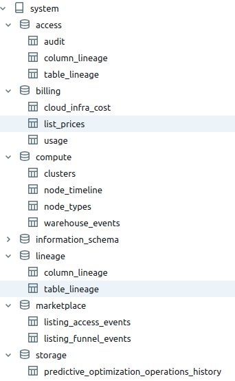

# Databricks template project with Asset Bundles, Python packaging and CI/CD automation

This project template provides a structured approach to enhance your productivity when delivering ETL pipelines on Databricks. Feel free to customize it based on your project's specific nuances and the audience you are targeting.

This project template demonstrates how to:

- structure your PySpark code inside classes/packages.
- package your code and move it on different environments (dev, staging, prod) on a CI/CD pipeline.
- configure your workflow to run in different environments with different configurations with [jinja package](https://pypi.org/project/jinja2/)
- configure your workflow to selectively run tasks, preventing collisions and interference between developers working in parallel.
- use a [medallion architecure](https://www.databricks.com/glossary/medallion-architecture) pattern by improving the data quality as it goes trought more refinement.
- use a Make file to automate repetitive tasks on local env.
- lint and format the code with [ruff](https://docs.astral.sh/ruff/) and [pre-commit](https://pre-commit.com/).
- set up VS Code to execute local unit tests for your transformations.
- utilize [pipenv/Pipfile](https://pipenv.pypa.io/) to prepare local and remote envs.
- utilize [pytest package](https://pypi.org/project/pytest/) to run unit tests on transformations.
- utilize [argparse package](https://pypi.org/project/argparse/) to build a flexible command line interface to start your jobs.
- utilize [funcy package](https://pypi.org/project/funcy/) to log the execution time of each transformation.
- utilize [Databricks CLI](https://docs.databricks.com/en/dev-tools/cli/index.html) and [Databricks Asset Bundles](https://docs.databricks.com/en/dev-tools/bundles/index.html) to package/deploy/run a Python wheel package on Databricks.
- utilize [Databricks SDK for Python](https://docs.databricks.com/en/dev-tools/sdk-python.html) to manage workspaces and accounts. This script enables your metastore system tables that have [relevant data about billing, usage, lineage, prices, and access](https://www.youtube.com/watch?v=LcRWHzk8Wm4).
- utilize [Databricks Unity Catalog](https://www.databricks.com/product/unity-catalog) instead of Hive as your data catalog and earn for free data lineage for your tables and columns and a simplified permission model for your data.
- utilize [Databricks Workflows](https://docs.databricks.com/en/workflows/index.html) to execute a DAG and [task parameters](https://docs.databricks.com/en/workflows/jobs/parameter-value-references.html) to share context information between tasks (see [Task Parameters section](#task-parameters)). Yes, you don't need Airflow to manage your DAGs here!!!
- utilize [Databricks job clusters](https://docs.databricks.com/en/workflows/jobs/use-compute.html#use-databricks-compute-with-your-jobs) to reduce costs.
- define clusters on AWS and Azure.
- execute a CI/CD pipeline with [Github Actions](https://docs.github.com/en/actions) after a repo push.

For a debate about the use of notebooks x Python packages, please refer to:
- [this article](https://dataengineeringcentral.substack.com/p/apple-pie-angry-people-other-news)
- [this Linkedin thread](https://www.linkedin.com/feed/update/urn:li:activity:7171661784997715968/)
- [this Linkedin thread](https://www.linkedin.com/feed/update/urn:li:activity:7170904539380875264/)   xxxxxx

### DAG

 

 

### Task Output

 

 

### Data Lineage (Catalog Explorer)

 

 

### System tables (Catalog Explorer)

 

 

### CI/CD pipeline

 

 

# Instructions

### 1) (optional) create a Databricks Workspace with Terraform

Follow instructions [here](https://github.com/databricks/terraform-databricks-examples)

### 2) install and configure Databricks CLI on your local machine

Follow instructions [here](https://docs.databricks.com/en/dev-tools/cli/install.html)

### 3) build python env and execute unit tests on your local machine

        make install

You can also execute unit tests from your preferred IDE. Here's a screenshot from [VS Code](https://code.visualstudio.com/) with [Microsoft's Python extension](https://marketplace.visualstudio.com/items?itemName=ms-python.python) installed.

### 4) deploy and execute on dev workspace.

Update "job_clusters" properties on wf_template.yml file. There are different properties for AWS and Azure.

        make deploy-dev

### 5) configure CI/CD automation

Configure [Github Actions repository secrets](https://docs.github.com/en/actions/security-guides/using-secrets-in-github-actions) DATABRICKS_HOST and DATABRICKS_TOKEN.

# Task parameters

 

- **task** (required) - determines the current task to be executed.
- **env** (required) - determines the AWS account where the job is running. This parameter also defines the default catalog for task.
- **default_schema** (optional) - determines the default schema to be used.
- **skip** (optional) - determines if the current task should be skipped.
- **debug** (optional) - determines if the current task should go through debug conditional.
