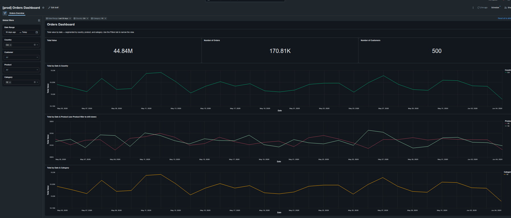

# databricks-template — agentic development for Databricks + production-ready ETL

## 🚀 Overview

> Stop spending weeks on boilerplate. This PySpark project template for Databricks gives you medallion architecture, Python packaging, unit + integration + load tests, CI/CD via Declarative Automation Bundles, DQX data quality, and service-principal-based production deploys — all wired together and ready to ship. Whether you're starting a new Databricks ETL project or looking for a reference implementation of production-ready PySpark pipelines, fork this and go.

If this saves you time, a star helps others find it. Let's [connect on LinkedIn](https://www.linkedin.com/in/andresalvati/).

## 🧪 Technologies

- Databricks Free Edition (Serverless)
- Databricks Runtime 18.0 LTS
- Databricks Unity Catalog
- Databricks Declarative Automation Bundles (former Asset Bundles)
- Databricks CLI
- Databricks Python SDK
- Databricks DQX
- Databricks AI Dev Kit
- Databricks Dashboards
- Claude Code
- PySpark 4.1
- Spark Declarative Pipelines (SDP)
- Python 3.12+
- GitHub Actions
- Pytest

## 📦 Features

This project template demonstrates how to:

- use agentic development (with Databricks AI Dev Kit and Claude Code) in data projects. The template ships with a [`CLAUDE.md`](CLAUDE.md) that documents the project's conventions.
- structure PySpark code inside classes/packages, deploy it as a Python wheel (instead of notebooks), and manage the project with [uv](https://docs.astral.sh/uv/).
- package and deploy code with [Declarative Automation Bundles](https://docs.databricks.com/en/dev-tools/bundles/index.html) to different environments (dev, staging, prod). Use [GitHub Actions](https://docs.github.com/en/actions) to automate CI/CD pipeline. 
- utilize [Databricks Lakeflow Jobs](https://docs.databricks.com/en/workflows/index.html) to execute a DAG - Yes, you don't need Airflow to manage your DAGs here!!!. Generate job definitions to run with environment-specific conditions using [Databricks SDK](https://docs.databricks.com/aws/en/dev-tools/sdk-python#create-a-job-that-uses-serverless-compute).
- isolate "dev" environments / catalogs to avoid concurrency issues between developer tests.
- separate deploy-time config (environment variables, CI secrets) from runtime config (job parameters overridable from the Databricks UI), keeping jobs flexible without coupling them to the build process.
- utilize job tags to track issues, costs, and ownership.
- use a [Lakeflow Spark Declarative Pipeline](https://docs.databricks.com/aws/en/ldp/) to run the same ETL logic side-by-side with the PySpark job, demonstrating both paradigms from one codebase.
- use the [medallion architecture](https://www.databricks.com/glossary/medallion-architecture) to organize your data.
- freeze a mutable dimension (`product.unit_price`) at sale time so a later price change never restates historical revenue — demonstrated **two ways**: an insert-only `MERGE` on the batch path and a streaming-table silver (`@dp.table` + `spark.readStream`) on the SDP path. A materialized view would *restate* the price; a streaming table appends each row once and *freezes* it.
- apply [Delta liquid clustering](https://docs.databricks.com/aws/en/delta/clustering) to the accumulating tables (append / `MERGE` / `replaceWhere`), where it amortizes — full-overwrite `raw.*` tables are intentionally left unclustered.
- run unit tests on transformations with the [pytest package](https://pypi.org/project/pytest/). Set up VS Code to run tests on your local machine.
- run integration tests by setting the input data and validating the output data.
- run load tests to exercise both the initial bulk load and incremental daily updates, validating that the pipeline handles production-scale data volumes without regressions.
- use [Databricks AI/BI Dashboards](https://docs.databricks.com/aws/en/dashboards) to visualize the gold layer.
- utilize the [coverage package](https://pypi.org/project/coverage/) to generate test coverage reports.
- use structured logging with a per-run `log_level` override and run-scoped correlation ID on every line, giving you full observability during incidents without a code change.
- lint and format code with [ruff](https://docs.astral.sh/ruff/) and [pre-commit](https://pre-commit.com/).
- use a Makefile to automate repetitive tasks.
- utilize [Databricks DQX](https://databrickslabs.github.io/dqx/) to enforce data quality rules, such as null checks, uniqueness, thresholds, and schema validation, and filter bad data into quarantine tables.
- utilize [service principals](https://docs.databricks.com/aws/en/admin/users-groups/service-principals) to run production code.
- utilize the [Databricks SDK for Python](https://docs.databricks.com/en/dev-tools/sdk-python.html) to manage catalogs, schemas, workspaces, and accounts. Refer to the `scripts` folder for examples.
- utilize [Databricks Unity Catalog](https://www.databricks.com/product/unity-catalog) to manage permissions and get data lineage.
- utilize serverless job clusters on [Databricks Free Edition](https://docs.databricks.com/aws/en/getting-started/free-edition) to deploy your pipelines.
- enforce production guardrails out of the box — identity-locked CI deploys, a health-check task that runs before any data is touched, wheel version pinning, per-task timeouts, schema-drift guards, queued runs, and on-call alerting that doesn't page on manual cancellations.

## 📐 Specs

Deep technical detail lives in [`specs/`](specs/) (the README stays a landing page):

- [**Architecture**](specs/architecture.md) — wheel/CLI surface, jobs DAG, job generation, CI/CD, job-level params, deploy-time env vars, logging, production guardrails, folder structure.
- [**Data model**](specs/data-model.md) — catalog/schema isolation, medallion data flow (diagram), table schemas, price-freeze semantics, liquid clustering, DQX/quarantine, lineage.
- [**Test plan**](specs/test-plan.md) — unit, integration, and load tests.

## 🧠 Resources

Agentic development:
- [Claude Code: 5 Essentials for Data Engineering](https://www.youtube.com/watch?v=YnIWW88l0mc)
- [Mastering Claude Code in 30 minutes](https://www.youtube.com/watch?v=6eBSHbLKuN0)
- [Introducing Databricks AI Dev Kit - Skills, MCP server, Builder App](https://www.youtube.com/watch?v=HFSIKrG8bRg)

Debates on the use of notebooks vs. Python packaging:
- [The Rise of The Notebook Engineer](https://dataengineeringcentral.substack.com/p/the-rise-of-the-notebook-engineer)
- [Please don’t make me use Databricks notebooks](https://medium.com/@seade03/please-dont-make-me-use-databricks-notebooks-3d07a4a332ae)
- [this Linkedin thread by Daniel Beach](https://www.linkedin.com/posts/daniel-beach-6ab8b4132_dataengineering-databricks-activity-7171661784997715968-OpRW)
- [this Linkedin thread by Ryan Chynoweth](https://www.linkedin.com/posts/ryan-chynoweth_using-databricks-notebooks-for-production-activity-7170868557621186561-eo3P)
- [this Linkedin thread by Jaco van Gelder](https://www.linkedin.com/posts/jwvangelder_my-honest-opinion-on-notebooks-vs-python-activity-7385955500007534592-xwHa/)

Sessions on Databricks Declarative Automation Bundles, CI/CD, and Software Development Life Cycle at Data + AI Summit 2025:
- [CI/CD for Databricks: Advanced Asset Bundles and GitHub Actions](https://www.youtube.com/watch?v=XumUXF1e6RI)
- [Deploying Databricks Asset Bundles (DABs) at Scale](https://www.youtube.com/watch?v=mMwprgB-sIU)
- [A Prescription for Success: Leveraging DABs for Faster Deployment and Better Patient Outcomes](https://www.youtube.com/watch?v=01JHTM2UP-U)

Other resources:
- [Goodbye Pip and Poetry. Why UV Might Be All You Need](https://codecut.ai/why-uv-might-all-you-need/)
- [The Spark Revolution You Didn’t See Coming: How Apache Spark 4.0 in Databricks Just Changed Everything](https://medium.com/@matiasmaquieira96/the-spark-revolution-you-didnt-see-coming-how-apache-spark-4-0-2a6422144f67)

## Dashboard

 

 

## Instructions

1) (Optional) Install [Databricks AI Dev Kit](https://github.com/databricks-solutions/ai-dev-kit) and [Claude Code](https://code.claude.com/docs/en/vs-code).

2) Create a [Databricks Free Edition](https://docs.databricks.com/aws/en/getting-started/free-edition) workspace.

3) Install and configure the Databricks CLI on your local machine. Check the current version in `databricks.yml`. Follow the instructions [here](https://docs.databricks.com/en/dev-tools/cli/install.html).

4) Set up the Python environment and run unit tests on your local machine.

        make sync && make unit-test
        
5) Initialize the workspace. Create an external location in Databricks and update the `storage-root` parameter in the Makefile. This step will create the catalogs, schemas, service principal, and the required grants. For more details, see [Overview of external locations](https://docs.databricks.com/aws/en/connect/unity-catalog/cloud-storage#external-locations). Then 
run:

        make init

6) Generate a secret for the service principal. In Databricks, go to: Workspace -> Settings -> Identity and access -> Service principals -> Secrets. Generate a new secret for your service principal and update the corresponding profiles in your .databrickscfg file. Your configuration should look similar to this:

        [dev]
        host          = https://xxxx.cloud.databricks.com/
        token         = bbbbbbbbbbbbbbbbbbbbbbbbbbbbbbbbbbbb
                        
        [staging]
        host          = https://xxxx.cloud.databricks.com/
        client_id     = yyyyyyyy-yyyy-yyyy-yyyy-yyyyyyyyyyyy
        client_secret = aaaaaaaaaaaaaaaaaaaaaaaaaaaaaaaaaaaa

        [prod]
        host          = https://xxxx.cloud.databricks.com/
        client_id     = yyyyyyyy-yyyy-yyyy-yyyy-yyyyyyyyyyyy
        client_secret = aaaaaaaaaaaaaaaaaaaaaaaaaaaaaaaaaaaa

7) Deploy and execute on the dev workspace.

        make deploy env=dev

8) Configure CI/CD automation with the service principal ID and secret. Configure [GitHub Actions repository secrets](https://docs.github.com/en/actions/security-guides/using-secrets-in-github-actions) (DATABRICKS_HOST, DATABRICKS_PRINCIPAL_ID, DATABRICKS_SECRET).

9) (Optional) You can also execute unit tests from your preferred IDE. Here's a screenshot from [VS Code](https://code.visualstudio.com/) with [Microsoft's Python extension](https://marketplace.visualstudio.com/items?itemName=ms-python.python) installed.

- 

## Star History

<a href="https://www.star-history.com/?repos=andre-salvati%2Fdatabricks-template&type=date&legend=top-left">
 <picture>
   <source media="(prefers-color-scheme: dark)" srcset="https://api.star-history.com/chart?repos=andre-salvati/databricks-template&type=date&theme=dark&legend=top-left" />
   <source media="(prefers-color-scheme: light)" srcset="https://api.star-history.com/chart?repos=andre-salvati/databricks-template&type=date&legend=top-left" />
   
 </picture>
</a>
