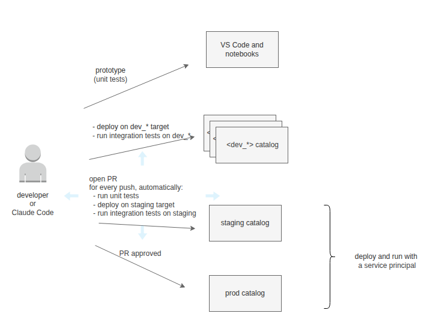
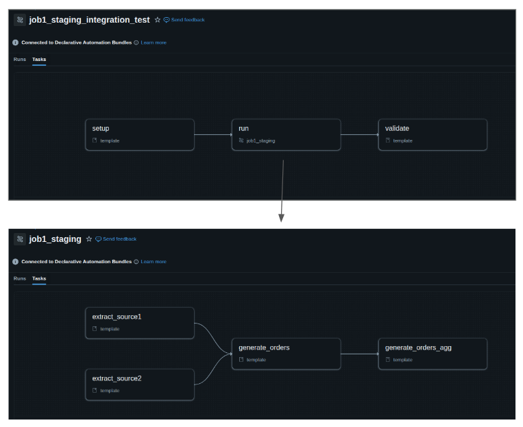
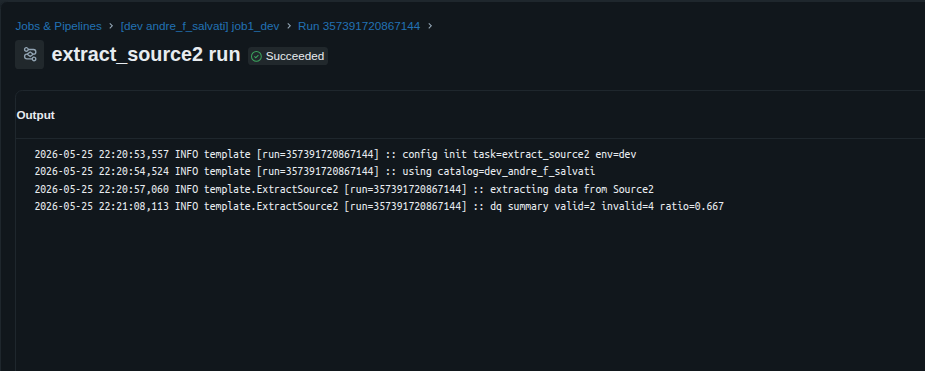
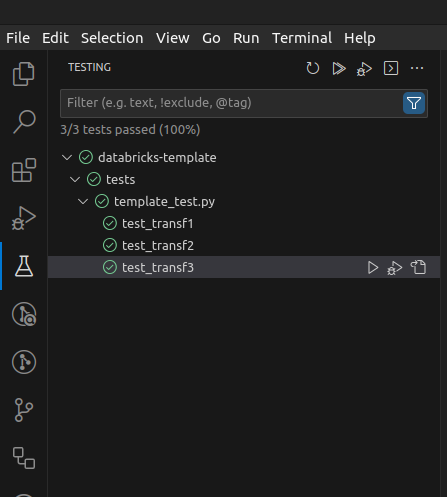

# databricks-template

> A production-ready PySpark project template with medallion architecture, Python packaging, unit tests, integration tests, coverage tests, CI/CD automation, Databricks Asset Bundles, and DQX data quality framework.


## 🚀 Overview

This project template is designed to boost productivity and promote maintainability when developing ETL pipelines on Databricks. It aims to bring software engineering best practices—such as modular architecture, automated testing, and CI/CD—into the world of data engineering. By combining a clean project structure with robust development and deployment workflows, this template helps teams move faster with confidence.

You’re encouraged to adapt the structure and tooling to suit your project’s specific needs and environment.

Interested in bringing these principles in your own project?  Let’s [connect on Linkedin](https://www.linkedin.com/in/andresalvati/).

## 🧪 Technologies

- Databricks Free Edition (Serverless)
- Databricks Runtime 18.0 LTS
- Databricks Asset Bundles
- Databricks DQX
- Databricks CLI
- Databricks Python SDK
- PySpark 4.1
- Python 3.12+
- Unity Catalog
- GitHub Actions
- Pytest

## 📦 Features

This project template demonstrates how to:

- structure PySpark code inside classes/packages, instead of notebooks.
- package and deploy code to different environments (dev, staging, prod). 
- use a CI/CD pipeline with [Github Actions](https://docs.github.com/en/actions).
- run unit tests on transformations with [pytest package](https://pypi.org/project/pytest/). Set up VSCode to run unit tests on your local machine.
- run integration tests setting the input data and validating the output data.
- isolate "dev" environments / catalogs to avoid concurrency issues between developer tests.
- show developer name and branch as job tags to track issues.
- utilize [coverage package](https://pypi.org/project/coverage/) to generate test coverage reports.
- utilize [uv](https://docs.astral.sh/uv/) as a project/package manager.
- configure job to run in different environments with different parameters with [jinja package](https://pypi.org/project/jinja2/).
- configure job to run tasks selectively.
- use [medallion architecture](https://www.databricks.com/glossary/medallion-architecture) pattern.
- lint and format code with [ruff](https://docs.astral.sh/ruff/) and [pre-commit](https://pre-commit.com/).
- use a Make file to automate repetitive tasks.
- utilize [argparse package](https://pypi.org/project/argparse/) to build a flexible command line interface to start the jobs.

<br>

- utilize [Databricks Asset Bundles](https://docs.databricks.com/en/dev-tools/bundles/index.html) to package/deploy/run a Python wheel package on Databricks.
- utilize [Databricks DQX](https://databrickslabs.github.io/dqx/) to define and enforce data quality rules, such as null checks, uniqueness, thresholds, and schema validation, and filter bad data on quarantine tables.
- utilize [Databricks SDK for Python](https://docs.databricks.com/en/dev-tools/sdk-python.html) to manage workspaces and accounts and analyse costs. Refer to 'scripts' folder for some examples. 
- utilize [Databricks Unity Catalog](https://www.databricks.com/product/unity-catalog) and get data lineage for your tables and columns.
- utilize [Databricks Lakeflow Jobs](https://docs.databricks.com/en/workflows/index.html) to execute a DAG and [task parameters](https://docs.databricks.com/en/workflows/jobs/parameter-value-references.html) to share context information between tasks (see [Task Parameters section](#task-parameters)). Yes, you don't need Airflow to manage your DAGs here!!!
- utilize serverless job clusters on [Databricks Free Edition](https://docs.databricks.com/aws/en/getting-started/free-edition) to deploy your pipelines.

## 🧠 Resources

For a debate on the use of notebooks vs. Python packaging, please refer to:
- [The Rise of The Notebook Engineer](https://dataengineeringcentral.substack.com/p/the-rise-of-the-notebook-engineer)
- [Please don’t make me use Databricks notebooks](https://medium.com/@seade03/please-dont-make-me-use-databricks-notebooks-3d07a4a332ae)
- [this Linkedin thread by Daniel Beach](https://www.linkedin.com/posts/daniel-beach-6ab8b4132_dataengineering-databricks-activity-7171661784997715968-OpRW)
- [this Linkedin thread by Ryan Chynoweth](https://www.linkedin.com/posts/ryan-chynoweth_using-databricks-notebooks-for-production-activity-7170868557621186561-eo3P)
- [this Linkedin thread by Jaco van Gelder](https://www.linkedin.com/posts/jwvangelder_my-honest-opinion-on-notebooks-vs-python-activity-7385955500007534592-xwHa/)

Sessions on Databricks Asset Bundles, CI/CD, and Software Development Life Cycle at Data + AI Summit 2025:
- [CI/CD for Databricks: Advanced Asset Bundles and GitHub Actions](https://www.youtube.com/watch?v=XumUXF1e6RI)
- [Deploying Databricks Asset Bundles (DABs) at Scale](https://www.youtube.com/watch?v=mMwprgB-sIU)
- [A Prescription for Success: Leveraging DABs for Faster Deployment and Better Patient Outcomes](https://www.youtube.com/watch?v=01JHTM2UP-U)

Other:
- [Goodbye Pip and Poetry. Why UV Might Be All You Need](https://codecut.ai/why-uv-might-all-you-need/)

## 📁 Folder Structure

```
databricks-template/
│
├── .github/                       # CI/CD automation
│   └── workflows/
│       └── onpush.yml             # GitHub Actions pipeline
│
├── src/                           # Main source code
│   └── template/                  # Python package
│       ├── main.py                # Entry point with CLI (argparse)
│       ├── config.py              # Configuration management
│       ├── baseTask.py            # Base class for all tasks
│       ├── commonSchemas.py       # Shared PySpark schemas
│       └── job1/                  # Job-specific tasks
│           ├── extract_source1.py
│           ├── extract_source2.py
│           ├── generate_orders.py
│           ├── generate_orders_agg.py
│           ├── integration_setup.py
│           └── integration_validate.py
│
├── tests/                          # Unit tests
│   └── job1/
│       └── unit_test.py            # Pytest unit tests
│
├── resources/                      # Databricks workflow templates
│   ├── wf_template_serverless.yml  # Jinja2 template for serverless
│   ├── wf_template.yml             # Jinja2 template for job clusters
│   └── workflow.yml                # Generated workflow (auto-created)
│
├── scripts/                           # Helper scripts
│   ├── generate_template_workflow.py  # Workflow generator (Jinja2)
│   ├── sdk_analyze_job_costs.py       # Cost analysis script
│   └── sdk_workspace_and_account.py   # Workspace and account management
│
├── docs/                           # Documentation assets
│   ├── dag.png
│   ├── task_output.png
│   ├── data_lineage.png
│   ├── data_quality.png
│   └── ci_cd.png
│
├── dist/                        # Build artifacts (Python wheel)
├── coverage_reports/            # Test coverage reports
│
├── databricks.yml               # Databricks Asset Bundle config
├── pyproject.toml               # Python project configuration (uv)
├── Makefile                     # Build automation
├── .pre-commit-config.yaml      # Pre-commit hooks (ruff)
└── README.md                    # This file
```

## CI/CD pipeline

<br>



<br>

## Jobs

<br>



<br>

## Task Output

<br>



<br>

## Data Lineage

<br>


<br>

## Data Quality (generated by Databricks DQX)

<br>


<br>


## Instructions

1) Create a workspace. Use a [Databricks Free Edition](https://docs.databricks.com/aws/en/getting-started/free-edition) workspace.


2) Install and configure Databricks CLI on your local machine. Check the current version on databricks.yaml. Follow instructions [here](https://docs.databricks.com/en/dev-tools/cli/install.html). 


3) Build Python env and execute unit tests on your local machine.

        make sync & make test


4) Deploy and execute on the dev workspace.

        make deploy env=dev


5) configure CI/CD automation. Configure [Github Actions repository secrets](https://docs.github.com/en/actions/security-guides/using-secrets-in-github-actions) (DATABRICKS_HOST and DATABRICKS_TOKEN).

6) You can also execute unit tests from your preferred IDE. Here's a screenshot from [VS Code](https://code.visualstudio.com/) with [Microsoft's Python extension](https://marketplace.visualstudio.com/items?itemName=ms-python.python) installed.

- 


## Task parameters

<br>


- **task** (required) - determines the current task to be executed.
- **env** (required) - determines the AWS account where the job is running. This parameter also defines the default catalog for the task.
- **user** (required) - determines the name of the catalog when env is "dev".
- **schema** (optional) - determines the default schema to read/store tables.
- **skip** (optional) - determines if the current task should be skipped.
- **debug** (optional) - determines if the current task should go through debug conditional.
