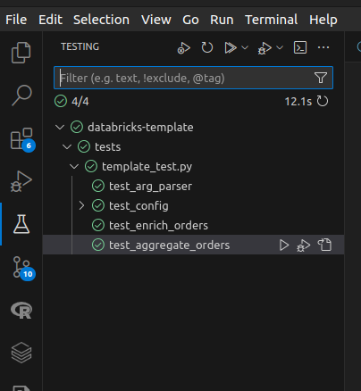

# Project Template for PySpark/Databricks with Python packaging and CI/CD automation

This project template provides a structured approach to enhance your productivity when delivering ETL pipelines on Databricks. Feel free to customize it based on your project's specific nuances and the audience you are targeting.

For a debate about the use of notebooks x Python packages, please refer to [this](https://dataengineeringcentral.substack.com/p/apple-pie-angry-people-other-news) article, [this](https://www.linkedin.com/feed/update/urn:li:activity:7171661784997715968/) Linkedin thread, and [this](https://www.linkedin.com/feed/update/urn:li:activity:7170904539380875264/) Linkedin thread.

This project template demonstrates how to:

- structure your PySpark code inside classes/packages.
- configure your pipeline to run in dev and prod environments.
- set up VS Code to execute local unit tests for your transformations.
- utilize [pipenv//Pipfile](https://pipenv.pypa.io/) instead of pip/requirements.txt.
- utilize [pytest package](https://pypi.org/project/pytest/) to run unit tests on transformations.
- utilize [argparse package](https://pypi.org/project/argparse/) to build a flexible command line interface to start your jobs.
- utilize [funcy package](https://pypi.org/project/funcy/) to log the execution time of each transformation.
- utilize [chispa package](https://pypi.org/project/chispa/) to validate the outputted dataframes from your transformations.
- utilize [Databricks CLI](https://docs.databricks.com/en/dev-tools/cli/index.html) and (the new!!!) [Databricks Asset Bundles](https://docs.databricks.com/en/dev-tools/bundles/index.html) to package/deploy/run a Python wheel package on Databricks.
- utilize [Databricks Unity Catalog](https://www.databricks.com/product/unity-catalog) instead of Hive as your data catalog and earn for free data lineage for your tables and columns and a simplified permission model for your data.
- utilize [Databricks Workflows](https://docs.databricks.com/en/workflows/index.html) to execute a DAG and [task parameters](https://docs.databricks.com/en/workflows/jobs/parameter-value-references.html) to share context information between tasks (see [Task Parameters section](#task-parameters)). Yes, you don't need Airflow to manage your DAGs here!!!
- utilize [Databricks job clusters](https://docs.databricks.com/en/workflows/jobs/use-compute.html#use-databricks-compute-with-your-jobs) to reduce costs. 
- execute a CI/CD pipeline with [Github Actions](https://docs.github.com/en/actions) after a repo push.

### DAG

 

 

### Data Lineage

 

 

### Task Output

 

 

# Instructions

### 1) install and configure Databricks CLI

Follow instructions [here](https://docs.databricks.com/en/dev-tools/cli/install.html)

### 2) build python env and execute unit tests

        pipenv install packages
        pipenv shell
        pytest tests/
        
You can also execute unit tests from your preferred IDE. Here's a screenshot from [VS Code](https://code.visualstudio.com/) with [Microsoft's Python extension](https://marketplace.visualstudio.com/items?itemName=ms-python.python) installed.

### 3) deploy and execute on dev and prod workspaces. 

        databricks bundle deploy --target dev
        databricks bundle run default_python_job --target dev

        databricks bundle deploy --target prod
        databricks bundle run default_python_job --target prod

### 4) configure CI/CD automation

Configure [Github Actions repository secrets](https://docs.github.com/en/actions/security-guides/using-secrets-in-github-actions) DATABRICKS_HOST and DATABRICKS_TOKEN. 

And now you can code the transformations for each task and run unit and integration tests.

The below diagram illustrates the CI/CD pipeline for this project.

 

 

# Task parameters

 

- **task** (required) - determines the current task to be executed.
- **env** (required) - determines the AWS account where the job is running. 
- **input** (required) - determines the bucket to be used as input.
- **output** (optional) - determines the bucket to be used as output. If omitted, uses the value provided on **input** parameter.
- **skip** (optional) - determines if the current task should be skipped.
- **debug** (optional) - determines if the current task should go through debug conditional.
