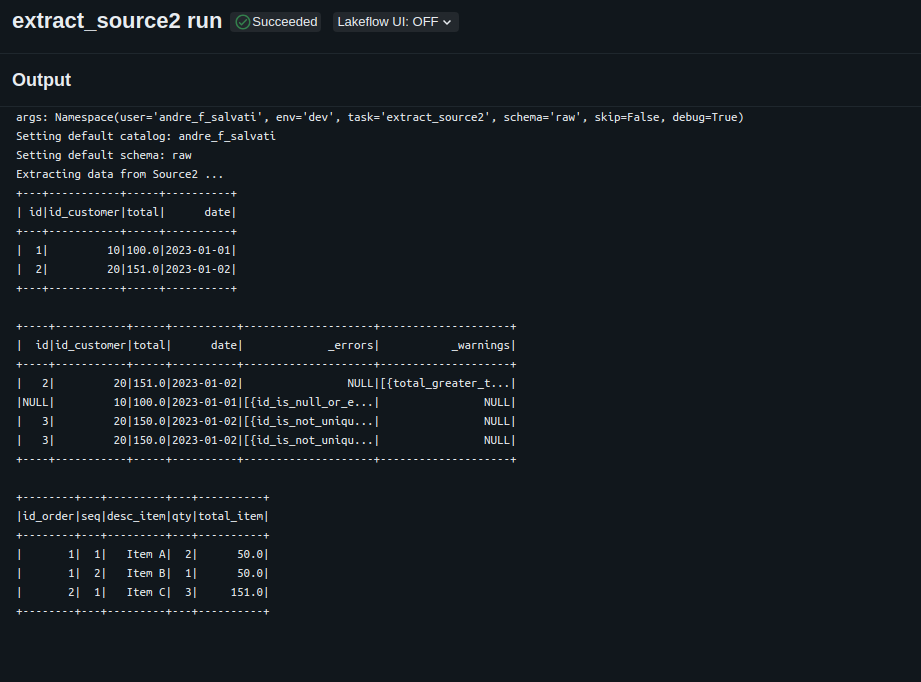
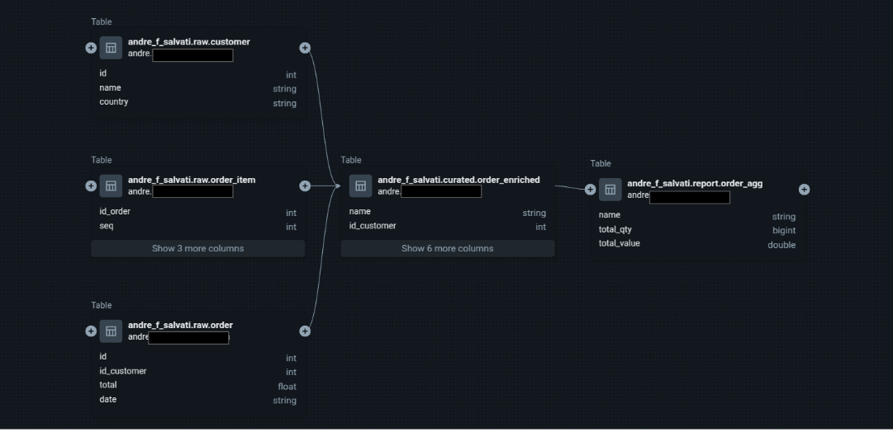
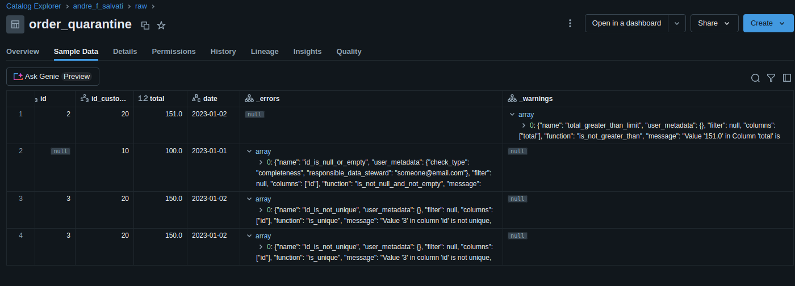
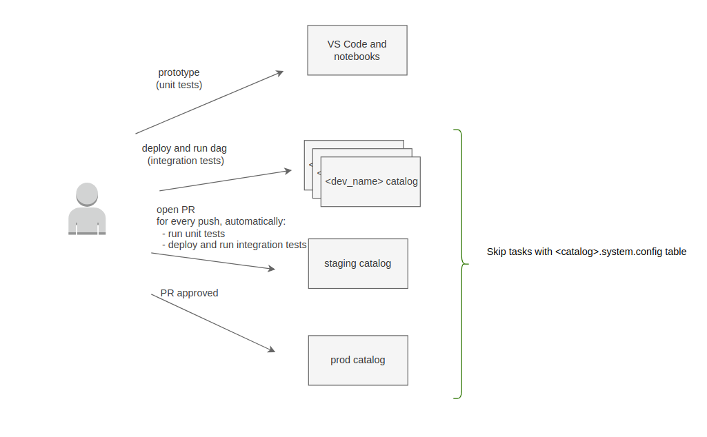

# A production-ready PySpark project template with medallion architecture, Python packaging, unit tests, integration tests, CI/CD automation, Databricks Asset Bundles, and DQX data quality framework.

## 🚀 Overview

This project template is designed to boost productivity and promote maintainability when developing ETL pipelines on Databricks. It aims to bring software engineering best practices—such as modular architecture, automated testing, and CI/CD—into the world of data engineering. By combining a clean project structure with robust development and deployment workflows, this template helps teams move faster with confidence.

You’re encouraged to adapt the structure and tooling to suit your project’s specific needs and environment.

Interested in bringing these principles in your own project?  Let’s [connect on Linkedin](https://www.linkedin.com/in/andresalvati/).

## 🧪 Technologies Used

- Databricks Free Edition (Serverless)
- PySpark 3.4+
- Databricks Asset Bundles
- Databricks DQX
- Databricks Jobs
- Databricks Unity Catalog
- Python 3.10+
- GitHub Actions
- Pytest

## 📦 Features

This project template demonstrates how to:

- structure PySpark code inside classes/packages.
- structure unit tests for the data transformations and set up VSCode to run them on your local machine.
- structure integration tests to be executed on different environments / catalogs.
- utilize [Databricks Asset Bundles](https://docs.databricks.com/en/dev-tools/bundles/index.html) to package/deploy/run a Python wheel package on Databricks.
- utilize [Databricks DQX](https://databrickslabs.github.io/dqx/) to define and enforce data quality rules, such as null checks, uniqueness, thresholds, and schema validation.
- utilize a [medallion architecture](https://www.databricks.com/glossary/medallion-architecture) pattern.

 

- package and deploy code to different environments (dev, staging, prod) using a CI/CD pipeline with [Github Actions](https://docs.github.com/en/actions).
- isolate "dev" environments / catalogs to avoid concurrency issues between developers testing jobs.
- configure the workflow to run in different environments with different parameters with [jinja package](https://pypi.org/project/jinja2/).
- configure the workflow to run tasks selectively.

 

- lint and format code with [ruff](https://docs.astral.sh/ruff/) and [pre-commit](https://pre-commit.com/).
- use a Make file to automate repetitive tasks.
- utilize [pipenv/Pipfile](https://pipenv.pypa.io/) to prepare local and remote envs.
- utilize [pytest package](https://pypi.org/project/pytest/) to run unit tests on transformations and generate test coverage reports.
- utilize [argparse package](https://pypi.org/project/argparse/) to build a flexible command line interface to start the jobs.
- utilize [funcy package](https://pypi.org/project/funcy/) to log the execution time of each transformation.

 

- utilize [Databricks SDK for Python](https://docs.databricks.com/en/dev-tools/sdk-python.html) to manage workspaces and accounts. The sample script enables metastore system tables with [relevant data about billing, usage, lineage, prices, and access](https://www.youtube.com/watch?v=LcRWHzk8Wm4).
- utilize [Databricks Unity Catalog](https://www.databricks.com/product/unity-catalog) and get data lineage for your tables and columns and a simplified permission model for your data.
- utilize [Databricks Lakeflow Jobs](https://docs.databricks.com/en/workflows/index.html) to execute a DAG and [task parameters](https://docs.databricks.com/en/workflows/jobs/parameter-value-references.html) to share context information between tasks (see [Task Parameters section](#task-parameters)). Yes, you don't need Airflow to manage your DAGs here!!!
- **utilize serverless clusters on Databricks Free Edition to deploy your pipelines.**
- utilize [Databricks job clusters](https://docs.databricks.com/en/workflows/jobs/use-compute.html#use-databricks-compute-with-your-jobs) to reduce costs.
- define Databricks clusters on AWS and Azure.

## 🧠 Resources

For a debate on the use of notebooks vs. Python packages, please refer to:
- [this article](https://dataengineeringcentral.substack.com/p/apple-pie-angry-people-other-news)
- [this Linkedin thread](https://www.linkedin.com/feed/update/urn:li:activity:7171661784997715968/)
- [this Linkedin thread](https://www.linkedin.com/feed/update/urn:li:activity:7170904539380875264/)

Sessions on Databricks Asset Bundles, CI/CD, and Software Development Life Cycle at Data + AI Summit 2025:
- [CI/CD for Databricks: Advanced Asset Bundles and GitHub Actions](https://www.youtube.com/watch?v=XumUXF1e6RI)
- [Deploying Databricks Asset Bundles (DABs) at Scale](https://www.youtube.com/watch?v=mMwprgB-sIU)
- [A Prescription for Success: Leveraging DABs for Faster Deployment and Better Patient Outcomes](https://www.youtube.com/watch?v=01JHTM2UP-U)

## Jobs (former Workflows)

 

 

## Task Output

 

 

## Data Lineage (Catalog Explorer)

 

 

## Data Quality (generated by Databricks DQX)

 

 

## CI/CD pipeline

 

 

## Instructions

### 1) Create a Databricks Workspace

option 1) utilize a [Databricks Free Edition](https://docs.databricks.com/aws/en/getting-started/free-edition) workspace.

option 2) create a Premium workspace. Follow instructions [here](https://github.com/databricks/terraform-databricks-examples)

### 2) Install and configure Databricks CLI on your local machine

Follow the instructions [here](https://docs.databricks.com/en/dev-tools/cli/install.html)

### 3) Build Python env and execute unit tests on your local machine

        make install & make test

You can also execute unit tests from your preferred IDE. Here's a screenshot from [VS Code](https://code.visualstudio.com/) with [Microsoft's Python extension](https://marketplace.visualstudio.com/items?itemName=ms-python.python) installed.

### 4) Deploy and execute on the dev workspace.

option 1) for Databricks Free Edition use:

        make deploy-serverless env=dev
        make deploy-serverless env=staging
        make deploy-serverless env=prod

option 2) for Premium workspace:

        Update "job_clusters" properties on wf_template.yml file. There are different properties for AWS and Azure.

        make deploy env=dev
        make deploy env=staging
        make deploy env=prod

### 5) configure CI/CD automation

Configure [Github Actions repository secrets](https://docs.github.com/en/actions/security-guides/using-secrets-in-github-actions) DATABRICKS_HOST and DATABRICKS_TOKEN.

## Task parameters

 

- **task** (required) - determines the current task to be executed.
- **env** (required) - determines the AWS account where the job is running. This parameter also defines the default catalog for the task.
- **user** (required) - determines the name of the catalog when env is "dev".
- **schema** (optional) - determines the default schema to read/store tables.
- **skip** (optional) - determines if the current task should be skipped.
- **debug** (optional) - determines if the current task should go through debug conditional.
