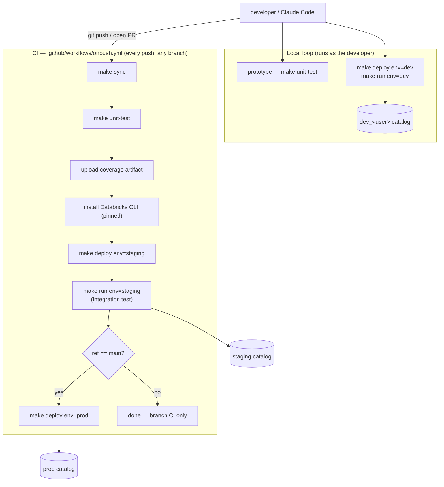

# Architecture

How the wheel is structured, how jobs are generated and run, and the guardrails that protect
production. For the data/medallion model see [data-model.md](data-model.md); for tests see
[test-plan.md](test-plan.md).

## Execution flow

`main.py` parses CLI args → instantiates `Config` → dispatches to a task class via the `TASKS`
dict → calls `.run()`. Each Databricks job task maps to one class; the `--task` arg value must
match a key in `TASKS`. Job definitions **and the SDP pipeline** are **generated** (not
hand-authored) by `scripts/sdk_generate_template_job.py` into `resources/jobs.yml`, which the
bundle then consumes. Never edit `resources/jobs.yml` directly (it is gitignored and regenerated
on every deploy).

## CLI surface

The wheel entry point is intentionally minimal. Anything tunable at runtime is a **CLI arg**
populated from a Databricks job-level parameter — not an environment variable (serverless compute
does not expose custom env vars to the process).

| Arg | Required | Purpose |
|---|---|---|
| `--task` | yes | Task key; in jobs, filled by `{{task.name}}`. |
| `--env` | yes | `dev` / `staging` / `prod` (or `local` for tests). |
| `--run-id` | no | Observability-only; filled by `{{job.run_id}}`, stamped on every log line. Defaults to `-`. |
| `--log-level` | no | `DEBUG`/`INFO`/`WARNING`, from job param `log_level` (default `INFO`). |
| `--quarantine-fail-ratio` | no | DQX hard-fail threshold for `extract_source2`. |
| `--seed-date` | no | ISO-8601 date for `seed_sources`; empty → today at runtime. |

> Removed deliberately (PR #21) — do **not** reintroduce: `--user`, `--debug`, `--schema`.
> Identity comes from `WorkspaceClient` at runtime with sanitization, not a CLI arg.

## Key classes

- **`Config`** (`src/template/config.py`) — runtime config: catalog/schema setup, logging, DQX
  engine. When `env=local` (unit tests) it mocks `WorkspaceClient` so tests run without Databricks.
- **`BaseTask`** (`src/template/baseTask.py`) — base class giving every task `self.spark`,
  `self.config`, `self.logger`, and `cluster_by(table, *cols)`.
- **Task classes** (e.g. `ExtractSource1`, `GenerateOrders`, `HealthCheck`) — subclass `BaseTask`,
  implement `run()`. Transformation logic lives in dedicated methods (e.g. `enrich_order`) so unit
  tests can call them directly without Spark tables.

## Jobs DAG

The batch job (`job1`) runs as a Lakeflow Job DAG; the declarative path (`job1_sdp`) runs the same
ETL as a Spark Declarative Pipeline.


### Adding a new job

1. Create task classes under `src/template/<jobN>/`, inheriting `BaseTask`.
2. Register them in the `TASKS` dict in `main.py` (`--task` choices auto-derive from `sorted(TASKS)`).
3. Add task construction to `scripts/sdk_generate_template_job.py` (use `_wheel_task()`; `--task`
   is filled by `{{task.name}}`).
4. `make deploy env=dev` to regenerate `resources/jobs.yml` and deploy.

## CI/CD

On every push (any branch), CI installs deps → unit tests → bundle validate → deploy to staging →
integration test on staging → (only on `main`) deploy to prod. Requires `DATABRICKS_HOST`,
`DATABRICKS_CLIENT_ID`, `DATABRICKS_CLIENT_SECRET`, `TEMPLATE_ALERT_EMAILS` repo secrets. CLI and
action versions are pinned. Staging/prod deploy **and run as the service principal**
(identity-locked); the local dev loop runs as the developer against a per-developer catalog.



## Job-level parameters (runtime, overridable per-run)

Defined as `JobParameterDefinition` in `sdk_generate_template_job.py` and referenced in every
task's `parameters` list via `{{job.parameters.*}}`. Operators override them per-run from the
Databricks Jobs UI "Run with different parameters" dialog — no redeploy.

| Parameter | CLI arg | Purpose | Default (dev/staging) | Default (prod) |
|---|---|---|---|---|
| `log_level` | `--log-level` | Bump to `DEBUG` for one prod run during incident response. | `INFO` | `INFO` |
| `quarantine_fail_ratio` | `--quarantine-fail-ratio` | Hard-fail `extract_source2` above this quarantine fraction. | `1.0` (disabled) | `0.1` |
| `seed_date` | `--seed-date` | ISO date for `seed_sources`; empty → today. Override to backfill a day. | `""` → today | `""` → today |

## Deploy-time environment variables (CI/build machine only)

Read by `sdk_generate_template_job.py` at deploy time — never on Databricks serverless. `os.environ.get()`
is correct here.

| Variable | Purpose | Default |
|---|---|---|
| `TEMPLATE_ALERT_EMAILS` | Recipients for prod `JobEmailNotifications`; CI overrides via secret. | `data-platform-oncall@example.com` |
| `TEMPLATE_SP_APP_ID` | CI bypass for the SCIM lookup of the service principal. | resolved from `SP_DISPLAY_NAME` |

## Logging

Structured logging via the `template` logger (configured in `config.py:_configure_logging`,
`propagate=False` to avoid py4j teardown noise). Every line carries the run-scoped correlation id
(`--run-id`) via a `logging.Filter`, so logs are correlatable after ingest. Use `self.logger.info(...)`
— never `print()`.


## Production guardrails

- **`mode: production`** on the prod target → DABs refuses to deploy if deployer ≠ run-as identity
  (the SP). A developer's local `make deploy env=prod` fails by design; only CI (on `main`) can push prod.
- **`run_as` / `permissions`** on every staging/prod job pinned to the SP's `application_id` (numeric),
  wired by `_get_service_principal_id`. (The dict key `service_principal_name` takes the numeric app id.)
- **`health_check`** runs first in prod and fails fast on a broken wheel / missing grant / unreachable
  warehouse before any medallion table is touched.
- **Wheel version pinning** — `_project_version()` reads `pyproject.toml` to pin the wheel filename in
  `JobEnvironment.dependencies`, so a forgotten rebuild can't silently deploy an old wheel.
- **Retries** — 0 in dev, 2 in staging/prod, backing off `MIN_RETRY_INTERVAL_MS` (60s).
- **Per-task `timeout_seconds`** (300s health-check, 900s extracts, 1800s transforms) so one hung
  task can't eat the whole job budget.
- **Schema-drift guard** — all medallion writes use `overwriteSchema=false` (the only exception is
  `ops._health`). Drift is a failure signal, not something to absorb.
- **Queued, not skipped** — `max_concurrent_runs=1` + `queue.enabled=true`: a late run queues.
- **Duration alert** — `on_duration_warning_threshold_exceeded` email backed by a `JobsHealthRule` on
  `RUN_DURATION_SECONDS > 1800`, so the alert has a real event to fire on.
- **Quiet pager** — `no_alert_for_canceled_runs` / `no_alert_for_skipped_runs` keep deliberate
  cancellations off on-call.

## Folder structure

```
databricks-template/
├── .github/workflows/onpush.yml   # CI/CD pipeline
├── src/template/                  # Python package (deployed as a wheel)
│   ├── main.py                    # CLI entry point + TASKS dict
│   ├── config.py                  # Config: catalogs/schemas, logging, DQX
│   ├── baseTask.py                # BaseTask (spark/config/logger/cluster_by)
│   ├── commonSchemas.py           # Canonical PySpark schemas
│   └── job1/                      # extract_source1/2, generate_orders(_agg),
│                                  #   health_check, seed_sources
├── tests/job1/                    # unit_test, unit_test_sdp, integration_setup/validate
├── resources/                     # jobs.yml (generated), orders_dashboard.lvdash.json (committed)
├── scripts/                       # sdk_generate_template_job.py, sdk_init_workspace.py,
│                                  #   sdk_drop_tables.py, project_costs.py, _sdk_sql.py
├── specs/                         # architecture / data-model / test-plan (this folder)
├── docs/                          # screenshots referenced by README + specs
├── databricks.yml · pyproject.toml · Makefile · .pre-commit-config.yaml
```
