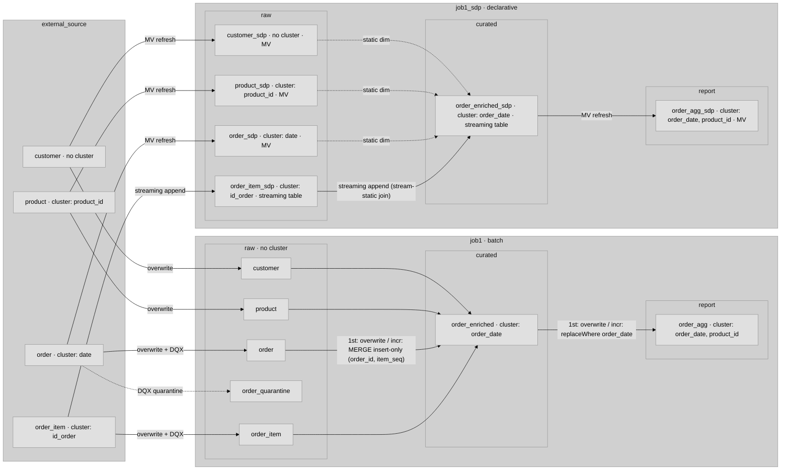
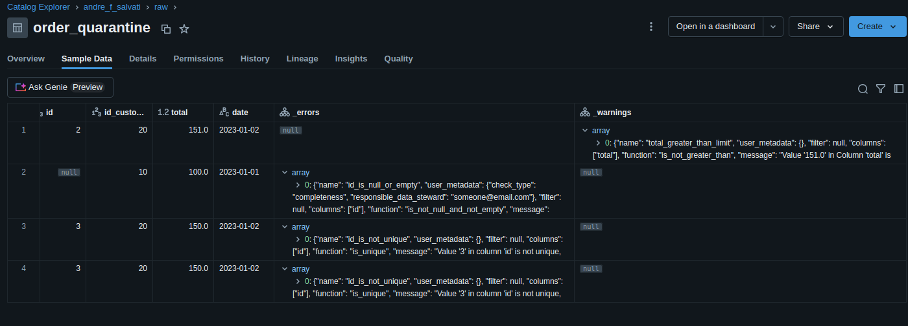
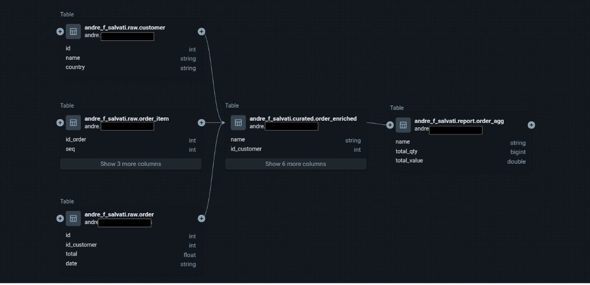

# Data model

The medallion layout, the catalog/schema isolation model, table schemas, the attribute-freeze
semantics, liquid clustering, and data quality. For how tasks/jobs are wired see
[architecture.md](architecture.md).

## The pipeline in plain words

It pulls the source data from `external_source` — customers, products, orders, and the order
items. **Bronze** (`raw`) is a faithful copy; **silver** (`curated.order_enriched`) joins them into
one row per order line, looking up the product to attach its name and category. Each order line
already carries its own `item_total` — the money for that line, fixed by the source when the order
was placed — so revenue is never recomputed from the current price list. **Gold**
(`report.order_agg`) rolls those lines up per customer / day / product, and `total_value` is just
the sum of those frozen `item_total`s.

Products can be **renamed** over time (the daily seed renames a couple — `"Product 1"` →
`"Product 1.1"`). Silver freezes the name onto each order line *as it is processed*, so a rename
never rewrites history: orders booked before the change keep the old name, orders after it get the
new one — both live side by side in gold for the same `product_id`. The **dashboard** identifies a
product by its *latest* name: the line chart **consolidates by `product_id`** (so a renamed product
stays one line, labeled with the current name), and the Product **filter** lists each product once
by that current name — selecting it shows the product's *full* history, pre- and post-rename. The old
name is never lost: gold keeps the frozen `product_name` on every row, so the rename is fully
auditable in the data even though the chart and filter present the single current label.

## Catalog / schema model (load-bearing)

**Environment isolation is at the *catalog* level, not the schema level.** The same medallion
schemas exist in every catalog.

- `dev_{sanitized_user}` — per-developer sandbox, created lazily by `Config.__init__`. Username is
  `current_user.me().user_name.split("@")[0]` with non-alphanumerics → `_` (e.g.
  `andre.f.salvati` → `andre_f_salvati`).
- `staging`, `prod` — shared; provisioned upfront by `make init` (`scripts/sdk_init_workspace.py`),
  which creates the catalogs, all `MEDALLION_SCHEMAS`, and the grants. Runtime jobs in these envs
  must **not** have `CREATE CATALOG` / `CREATE SCHEMA` privilege — that belongs to bootstrap, not
  the runtime wheel. (In `config.py`, `CREATE` calls live only under the `args.env == "dev"` branch.)

Medallion schemas (`MEDALLION_SCHEMAS` in `config.py`):

| Schema | Layer | Content |
|---|---|---|
| `external_source` | source | Raw input — `seed_sources` (prod, daily) or the integration `setup` task (dev/staging). |
| `raw` | bronze | Direct copies from sources. |
| `curated` | silver | Joined/enriched tables. |
| `report` | gold | Aggregated tables. |
| `ops` | internal | Health-check table. Named `ops` because UC reserves `system`. |

Each task's input/output tables are **hardcoded** in the task module (e.g. `raw.customer` →
`curated.order_enriched`) — the dbt `ref()` pattern. The medallion layer is a semantic contract,
not a runtime parameter; don't parameterize it.

## Medallion data flow

Two parallel paths run from the same source tables. Edge labels are write modes; dotted edges are
static-dimension reads or the DQX quarantine branch; per-table labels show cluster keys and
MV-vs-streaming-table.

- **`raw.*` batch is intentionally unclustered** — full daily overwrite means clustering can't amortize.
- **`raw.*_sdp` picks up cluster keys from the decorator** — set at table creation; no `ALTER TABLE`.
- **Dashed arrows into `order_enriched_sdp`** are static dimension reads; only `order_item_sdp` drives the stream.
- **`external_source` clustering** is set by `seed_sources._ensure_tables()` in prod and by
  `integration_setup.cluster_by()` calls in dev/staging.

## Table schemas

Canonical schemas live in `commonSchemas.py` (`order_enriched_schema`, `order_agg_schema`,
`product_schema`).

- **`curated.order_enriched`**: `customer_name, country, customer_id, order_id, order_total,
  order_date (DateType), product_id, product_name, product_category_id, category_name, item_seq,
  item_description, item_quantity, item_total`.
- **`report.order_agg`**: `customer_name, country, order_date (DateType), product_id, product_name,
  product_category_id, category_name, total_quantity, total_value, total_orders`.

`total_value` in gold is `SUM(item_total)` — the line value the source froze on the order at sale
time, so a later price change never restates historical revenue. `product_name` (`"Product 1"`) and
`category_name` (`"Category 2"`, derived as `concat('Category ', product_category_id)`) are
human-readable labels carried alongside the numeric ids; the dashboard displays the labels.
`product_name` is **frozen** per row at first processing (see below) — it is the mutable attribute the
freeze pattern is demonstrated against.

### Field naming conventions

Medallion field names follow a small set of rules (canonical schemas in `commonSchemas.py` are the
source of truth):

- **`{entity}_id` suffix** for identifiers — `customer_id`, `product_id`, `order_id`,
  `product_category_id`.
- **Entity-qualified names** — `customer_name`, `product_name`, `category_name`, `order_date`,
  `order_total` (not bare `name` / `date` / `total` once past the source layer).
- **`item_*` prefix** for order-item-level fields — `item_seq`, `item_description`, `item_quantity`,
  `item_total`.
- **`total_*` prefix** for gold aggregates — `total_quantity`, `total_value`, `total_orders`.
- **No abbreviations** — spell words out (`quantity`, not `qty`; `description`, not `desc`); the raw
  source columns (`qty`, `desc_item`, `total_item`) are renamed at the silver boundary.
- **`DateType` for dates** — `order_date` is cast from the source string to `DateType` in silver.
- **`_sdp` suffix** for the declarative-pipeline table variants (`order_enriched_sdp`,
  `order_agg_sdp`, `product_sdp`, …) so the batch and SDP outputs never collide in the same schema.

## Incremental silver: product-name freeze (load-bearing)

`external_source.product` is a mutable dimension — the daily seed renames a couple of products each
run (`"Product 1"` → `"Product 1.1"` → `"Product 1.2"`, suffix = cumulative rename count). The
pipeline freezes `product_name` onto each order line at sale time, so a later rename never relabels
already-booked orders (`unit_price` is a static attribute and `total_value = SUM(item_total)`, so
revenue is never restated either). **Both** pipelines freeze, by different mechanisms:

- **`job1` (batch)** — `generate_orders` does first-run-full / incremental-after: first run (silver
  empty) overwrites all backfilled orders; every subsequent run enriches only `date = seed_date`
  orders and **`MERGE … WHEN NOT MATCHED THEN INSERT`** (insert-only, never update) keyed on
  `(order_id, item_seq)`. Gold mirrors this: first-run full overwrite, then `replaceWhere
  order_date = DATE'<seed_date>'`.
- **`job1_sdp` (declarative)** — silver (`curated.order_enriched_sdp`) and bronze `raw.order_item_sdp`
  are **streaming tables** (`@dp.table` + `spark.readStream`). A stream–static join (streaming
  `order_item` fact ⨝ static dims) appends each row once and never reprocesses it, so `product_name`
  is frozen on append. **A materialized view would restate** the name on every refresh — that is
  why silver had to become a streaming table. Gold stays an MV because it re-sums already-frozen silver.

Why an MV restates but a streaming table freezes: an MV is *defined as a query over current inputs*
and recomputes from scratch (latest-wins); a streaming table consumes new input rows once and
appends. "Incremental" (Enzyme re-reading only changed files) is efficiency, not semantics. The
dashboard consolidates the "by product" chart by `product_id` (labeled with each product's latest
name) and the Product filter selects by that same latest name, so a renamed product stays one line
and filtering it shows its full pre-/post-rename history; the frozen historical names remain in
`report.order_agg` for audit. Known limitations (acceptable for a template): the first-run backfill
freezes the *current* name; freeze is at *processing* time, not strictly *order date*; country is
frozen at append time in SDP.

## Liquid clustering

Clustering keys are set on the **accumulating** tables only (`raw.*` batch are full-overwritten
daily, so clustering can't amortize — left unclustered): `external_source.order` (`date`),
`external_source.order_item` (`id_order`), `external_source.product` (`product_id`),
`curated.order_enriched` (`order_date`), `report.order_agg` (`order_date, product_id`). Batch tasks
call `BaseTask.cluster_by(table, *cols)` (idempotent `ALTER TABLE … CLUSTER BY`) after writing; SDP
tables pass `cluster_by=[...]` to the `@dp.table` / `@dp.materialized_view` decorator. Clustering is
metadata-only — it does not rewrite existing data.

## Data quality (DQX)

`ExtractSource2` demonstrates the DQX pattern: define rules as `DQRowRule` / `DQForEachColRule` /
`DQDatasetRule`, call `dq_engine.apply_checks_and_split()`, write invalid rows to a `_quarantine`
table. The `--quarantine-fail-ratio` job parameter hard-fails the task when too many rows are
quarantined (silent quarantine bloat is the main DQX failure mode in prod).

## Data lineage (Unity Catalog)

Unity Catalog captures table-to-table lineage across the medallion layers automatically.

